#WWDC 2015 videos
2015 年WWDC 所有的视频链接：
[2015 WWDC](https://developer.apple.com/videos/wwdc/2015/)

####我觉得可用于项目的未使用的技术有：
 * [App Thinning](#1)
 * [Network with NSURLSession](#2)
 * [UI Testing](#3)
 * [UIKit Dynamics](#4)

<h1 id="1"></h1>
##App Thinning 

###App Slicing
这一项功能只针对iOS 平台，Slicing就是创造并传输为不同目标设备而设计的变体应用包（variant,以下简称定制化下载包）的处理过程。**一个定制化下载包仅包含针对特定设备所需要的可执行架构以及资源**。你可以继续开发并且把完整版本的应用上传到iTunes Connect，然后App Store会根据玩家设备类型和分辨率创造并传输对应的应用。这里，你可以认为资源根据玩家设备分辨率和类型的不同而分割成了多种类型，GPU资源也根据设备能力进行了切分，当用户安装应用的时候，他们可以下载并安装适合自己设备的定制化应用包。**基本上来说项目里面用了Assets.xcassets就支持这个功能了**
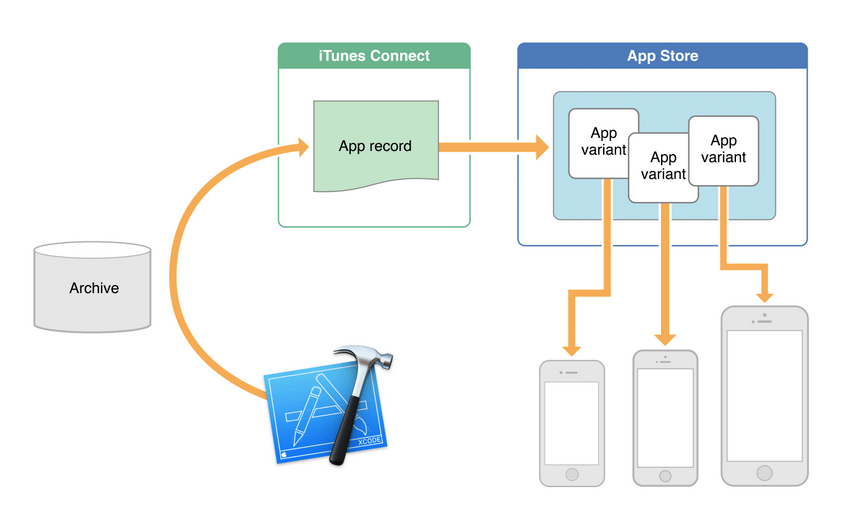

***
###On-Demand Resources(ODR)
On-Demand资源指的是你可以通过关键词和命令的方式进行分组归类的资源，比如图像和音频，App Store会把这些资源放在苹果服务器上并且为你管理下载。On-Demand资源可以加快下载速度并缩小应用包体，提高用户的首次登录体验。比如，一款游戏应用可以根据等级和任务的不同把资源分组，在玩家达到下一个等级或者完成一个任务之后才会用到后续的资源，同样，应用也可以只在用户进行IAP购买的时候提供对应的资源。

当一些on-demand资源不再需要而且磁盘空间较少的时候，操作系统会自动清除它们。如果你在App Store之外对自己的应用进行测试或者分发，那就需要你自己来管理这些On-Demand资源。需要注意的是，可执行的on-demand资源是不支持的，App Store也会对on-Demand资源进行分割（即上面说过的Slicing），进一步提高用户体验。

对于用户们来说，on-demand资源是以透明的形式在后台运作的，当用户需要对应功能的时候，这些资源就会被提供。

[如何配置ODR](https://developer.apple.com/library/prerelease/watchos/documentation/Foundation/Reference/NSBundleResourceRequest_Class/index.html#//apple_ref/doc/uid/TP40015084).

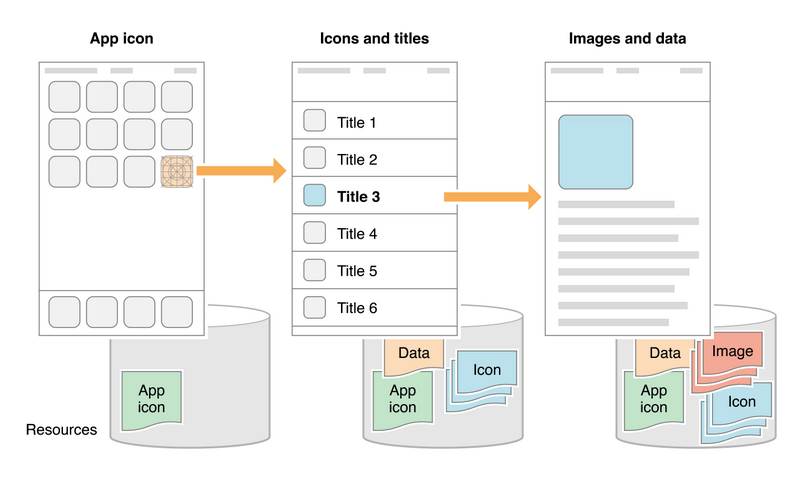
***
###BitCode
Bitcode是一个已编译程序（Compiled Program）的中间代码（intermediate representation）。如果你上传到iTunes Connect里的应用包含bitcode的话，就可以被编译和链接到App Store。加入Bitcode可以让苹果在未来对你的应用二进制（app binary）进行再次优化，而不需要你向App Store提交新版本。

注意：对于iOS应用来说，Bitcode是默认但可选择的。如果你提供Bitcode，那么应用包里的所有应用和框架都需要加入Bitcode，而watchOS应用则必须加入Bitcode。

<h2 id="2"></h2>
##Networking with NSURLSession

###App Transport Security
> * 不允许明文的http 链接
> * 鼓励使用更加安全的Https.
> * 默认使用安全的方式连接
> * 在 Info.plist 里可以添加自定义的网络安全配置。以下的配置就是允许媒体服务器使用不安全的链接。

也可以制定允许任意的链接：NSAllowsArbitraryLoads = YES。aka Http & Https。

###New protocol support in NSURLSession
Http 1.1 的缺点
> * One outstanding request(在单位时间内只能处理一个链接，head-of-line blocking)
> * HTTP pipelining (将多个HTTP请求整批提交的技术，而在发送过程中不需先等待服务端的回应)
> * Mutiple connections 
> * Textual protocol overhead (处理换行，空格，大小写等带来的负荷)
> * Header compression (请求头的压缩)

因此，Http/2 is coming!!!NSURLSession 支持 HTTP/2 协议。向后兼容HTTP/1.1 。我们需要的是一个支持HTTP/2 的服务器。

###NSURLSession on watchOS

###NSURLSession API changes
在iOS 9 ，苹果已经弃用NSURLConnection 。所以新特性都添加在NSURLSession。并且WatchOS 是不支持NSURLConnection的。

##### New NSURLSession API

> * NSHTTPCookieStorage.允许 App 和 Extensions 间共享cookies。

> * NSURLSessionStreamTask

<h3 id="3"></h3>
##XCode 7 UI Testing

在开发领域里，测试一直是保障产品质量关键。从 Xcode 4 以来，测试在 app 开发中的地位可谓是逐年上升。从 XCT 框架的引入，到测试 target 成为新建项目时的默认，再到去年加入的异步代码测试和性能测试。可以说现在 Xcode 自带的测试框架已经能满足绝大部分单元测试的需求了。

但是这并不够。开发一个 iOS app 从来都是更注重 UI 和用户体验的工作，而简单地单元测试可以很容易地保证 model 层的正确，却很难在 UI 方面有所作为。如何为一个 app 编写 UI 测试一直是 Cocoa 社区的难题之一。之前的话有像是 KIF，Automating，甚至是 FBSnapshotTestCase 这种脑洞大开的方案。今年 Apple 给出了一个更加诱人的选项，那就是 Xcode 自带的 XCUITest 的一系列工具。

和大部分已有的 UI 测试工具类似，XCUI 使用 Accessibility 标记来确定 view，但因为是 Apple 自家的东西，它可以自动记录你的操作流程，所以你只需要书写最后的验证部分就可以了，比其他的 UI 测试工具方便很多。
在Xcode 7 ，UI Testing 比之前InStruments 的UIAutomation 更加方便，好用。使用新的XCTest ，需要在project 新建一个UI Testing Bundle。

***
录制好脚本后，点击运行：

**参考链接**

[Testing：Xcode 7 UI testing, a first look](http://www.mokacoding.com/blog/xcode-7-ui-testing/).

<h4 id="4"></h4>

##UIKit Dynamics
###1）Collision Bounds

支持非矩形的碰撞,下图中表现出非矩形碰撞的效果。（不再是以前那种只能识别矩形区域的碰撞了）

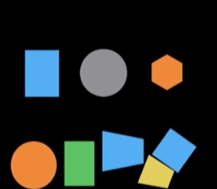
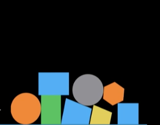

###2）UIDynamicItemGroup 
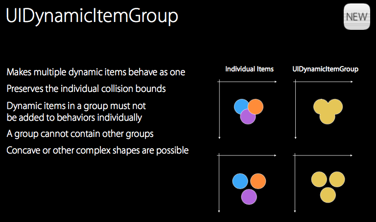

###3）UIFieldBehavior

任何添加到设置区域的UIView 对象都会被添加上该区域所附带的动画效果。

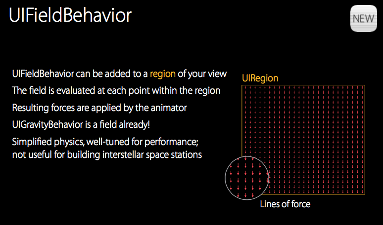
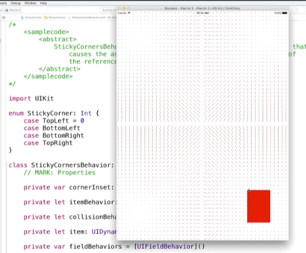
###4）UIDynamicItemBehavior
DynamicItemBehivior属性：elasticity(弹性)，friction（摩擦力），density（密度），resistance（阻力），angularResistance (角度阻力)。
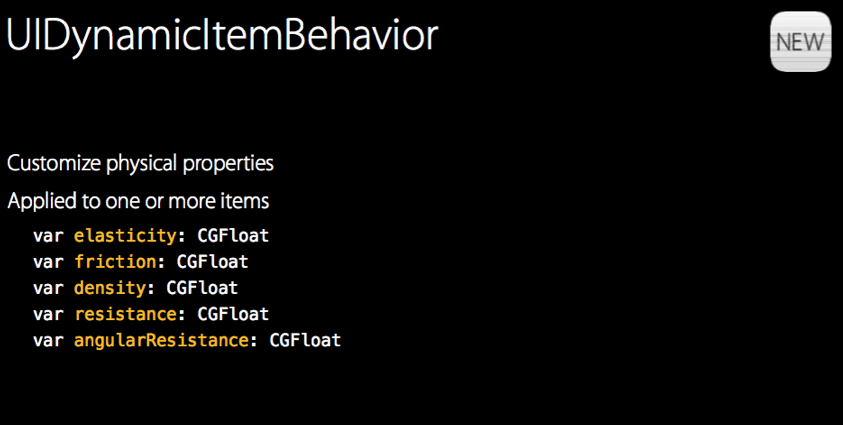
IOS 9新添加的属性：charge 和 anchored 。charge 影响你的item 在电磁场中的变现。

###5) UISnapBehavior
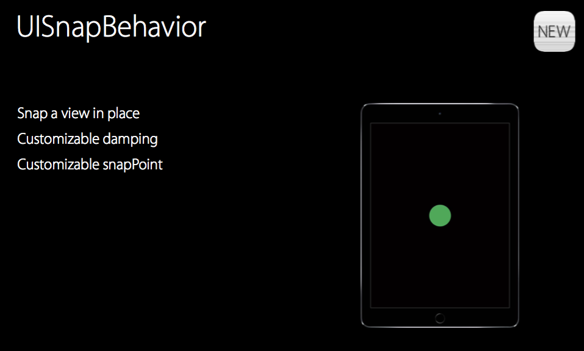

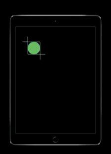
###6) UIAttachmentBehavior
> * Distance Attachment
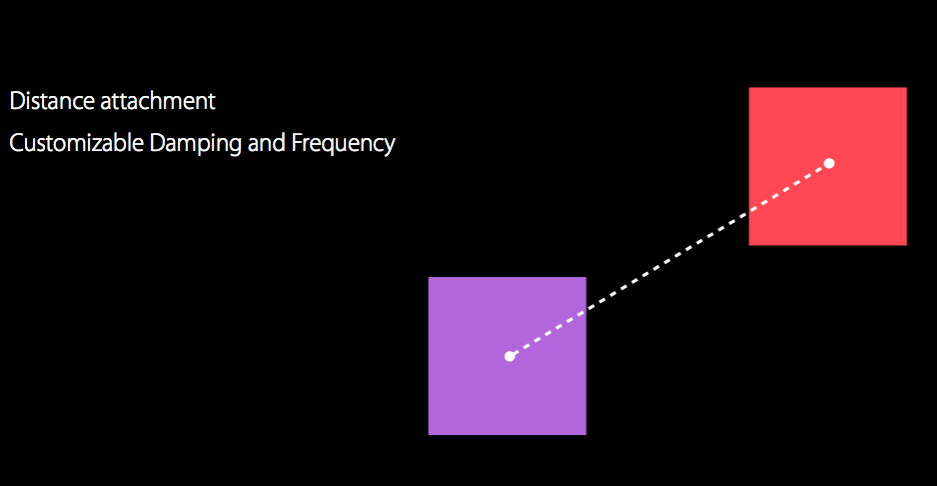
> * Limit Attachment
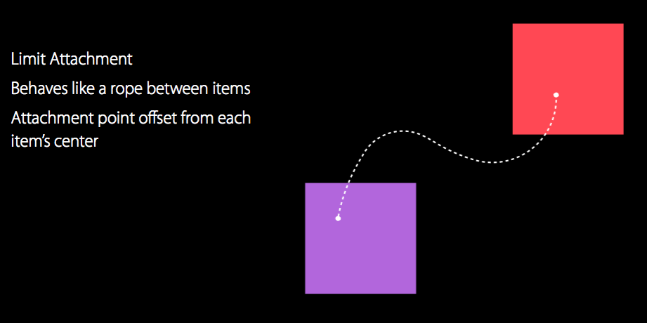
> * Fixed Attachment
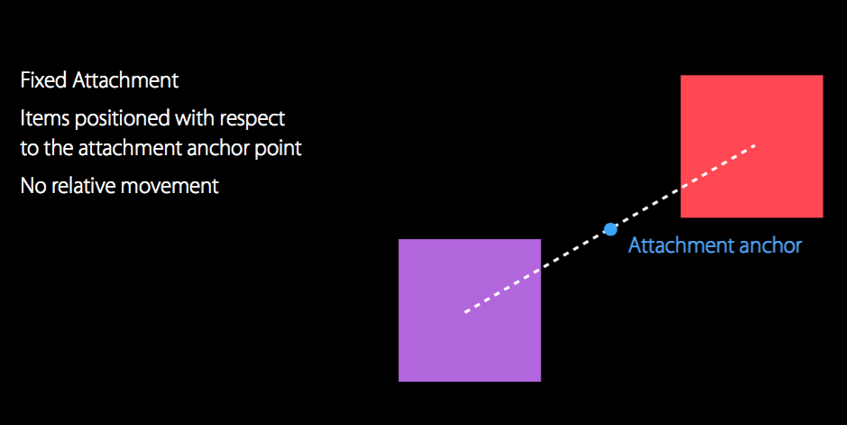
> * Pin Attachment
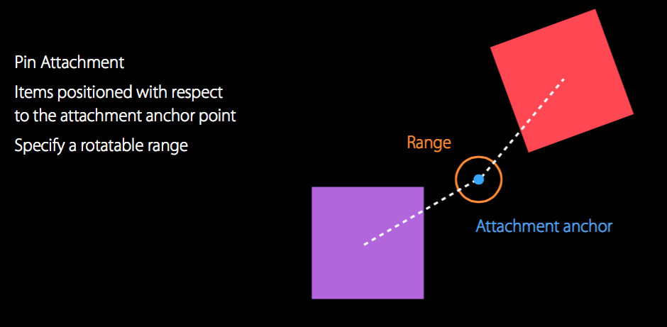
> * Sliding Attachment
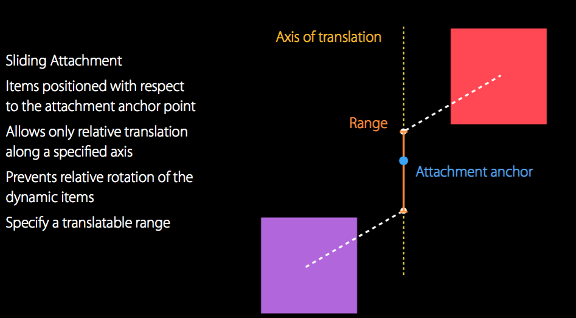

###7) 调试动画的新方法

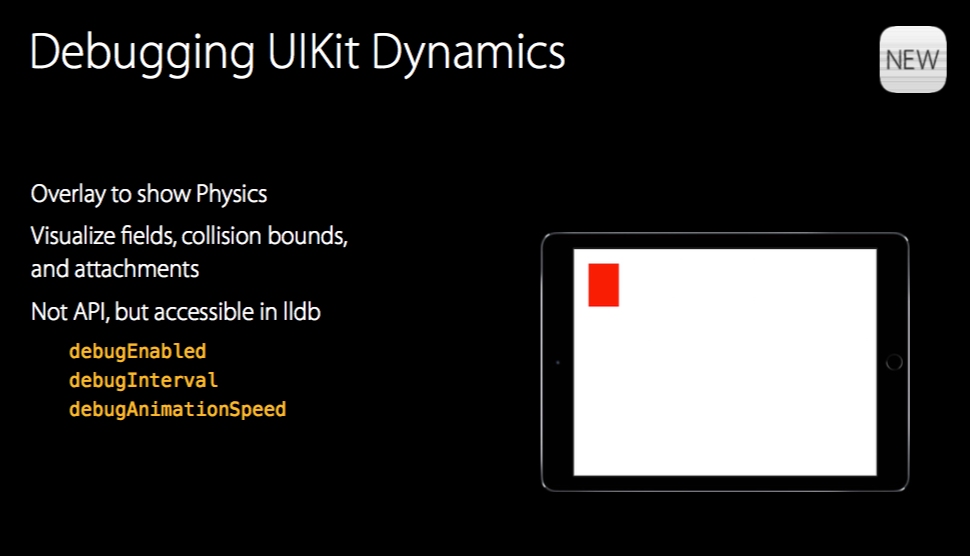

下面展示的是动画的区域。

###8)UIVisualEffectView
可用于制作日间，夜间模式。
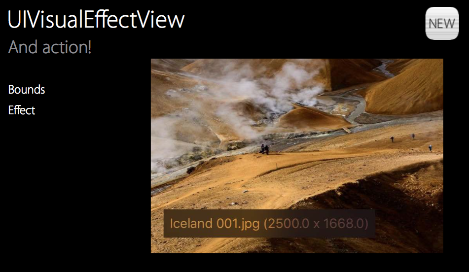

