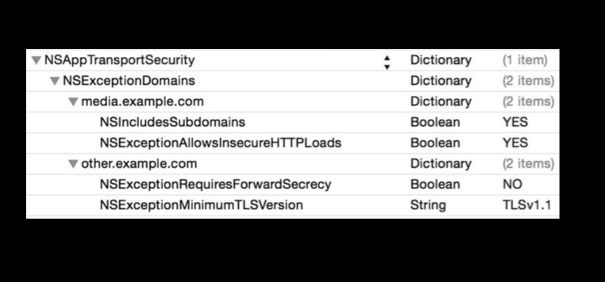
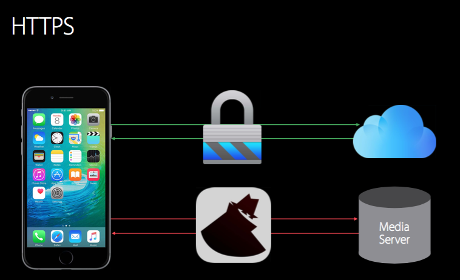
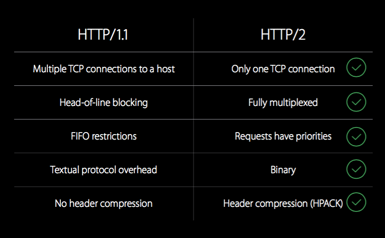
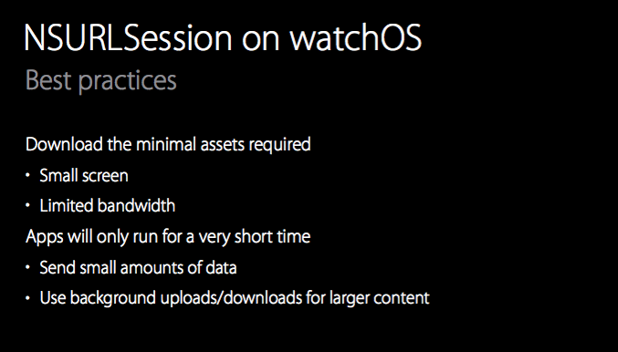
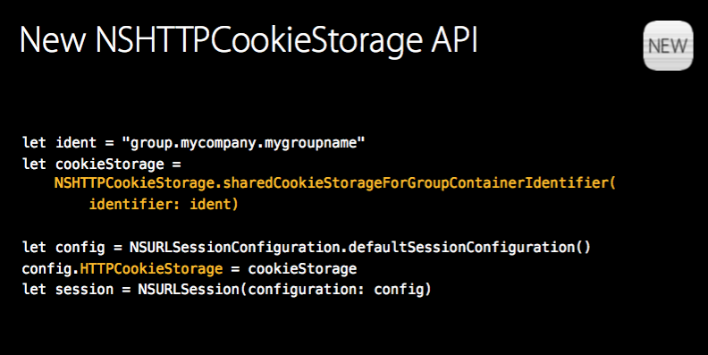
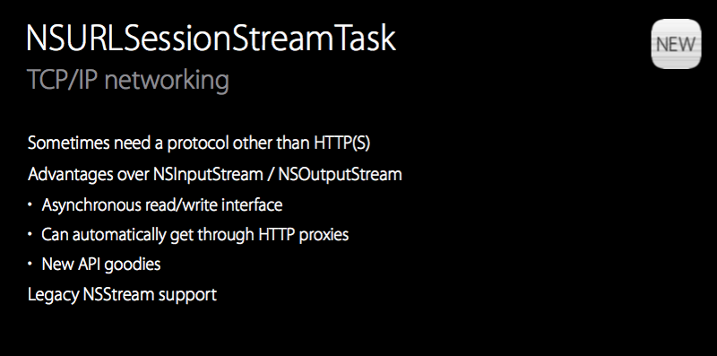

##Networking with NSURLSession

###App Transport Security
> * 不允许明文的http 链接
> * 鼓励使用更加安全的Https.
> * 默认使用安全的方式连接
> * 在 Info.plist 里可以添加自定义的网络安全配置。以下的配置就是允许媒体服务器使用不安全的链接。

也可以制定允许任意的链接：NSAllowsArbitraryLoads = YES。aka Http & Https。

###New protocol support in NSURLSession
Http 1.1 的缺点
> * One outstanding request(在单位时间内只能处理一个链接，head-of-line blocking)
> * HTTP pipelining (将多个HTTP请求整批提交的技术，而在发送过程中不需先等待服务端的回应)
> * Mutiple connections 
> * Textual protocol overhead (处理换行，空格，大小写等带来的负荷)
> * Header compression (请求头的压缩)

因此，Http/2 is coming!!!NSURLSession 支持 HTTP/2 协议。向后兼容HTTP/1.1 。我们需要的是一个支持HTTP/2 的服务器。

###NSURLSession on watchOS

###NSURLSession API changes
在iOS 9 ，苹果已经弃用NSURLConnection 。所以新特性都添加在NSURLSession。并且WatchOS 是不支持NSURLConnection的。

##### New NSURLSession API

> * NSHTTPCookieStorage.允许 App 和 Extensions 间共享cookies。

> * NSURLSessionStreamTask
