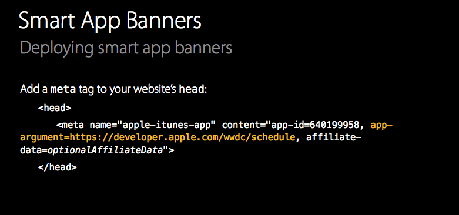
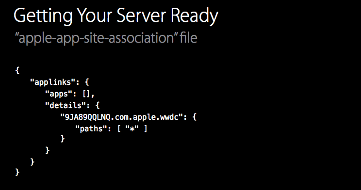
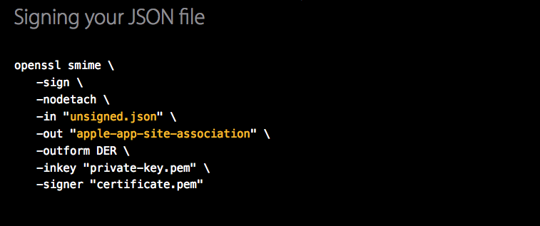
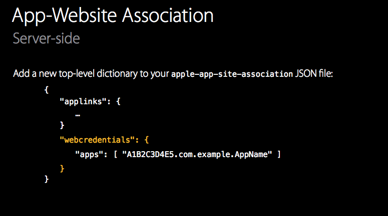
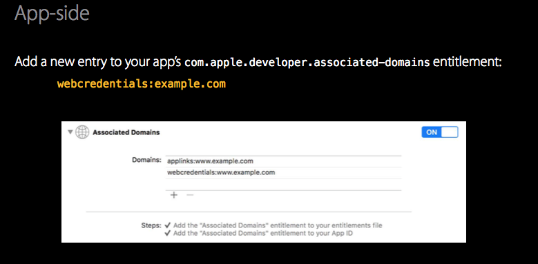
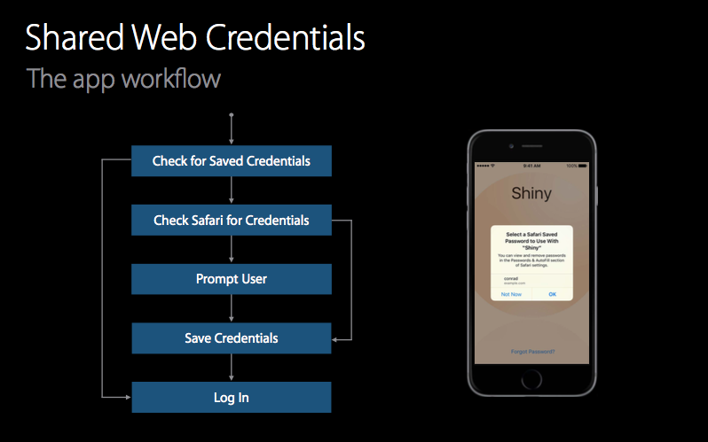

##App 的无缝链接

### 1) 网站链接到App.

### 2) App 处理链接到网站的请求.
以往app之间的通讯是通过 Custom URL Schemes 来实现的。但是这种方式的弊端有：
> 当A 与 B 通讯，它无法保证，与你通讯的应用是你所希望的，因为它不是唯一被应用所拥有的。当B应用没有安装的时候，你要处理这种异常。同时也没有办法保证不泄漏用户的隐私。
 
更好的方式？
> A 与 B 应用应该有很强的耦合关系。当链接想试图打开应用 B，而B 并没有安装的时候，应该回调到Safari。同时要更好的保护用户的隐私，不存在应用A 知道 应用B 已经安装的前提下，再调用事件。

**Universal Link** 满足了我们所需要的更好的方式：

服务器端的任务：
> * Create your "apple-app-site-association"file
> 
9JA89QQLNQ 是我们的team ID。com.apple.wwdc 是bundle ID 。"path":["*"] 为接受网站任意的链接。
> * SSL certificate.
> * Sign your file.
> 
> * Upload to your server
> 
[Use Universal Links to Enable Your App to Handle Links to Your Website](https://developer.apple.com/library/prerelease/ios/releasenotes/General/WhatsNewIniOS/Articles/iOS9.html#//apple_ref/doc/uid/TP40016198-DontLinkElementID_2)
### 3) 帮助用户登录到你的应用.
Safari 保存用户的证书，可以通过iCloud keychain 来同步所有设备。可以提示用户选择合适的账号密码以及自动补全保存过的账号密码。在iOS 8 ，Shared Web Credentials 可以通过Safari保存的用户证书来帮助用户登录。

在服务器端，需要配置：

在客户端，需要配置：

