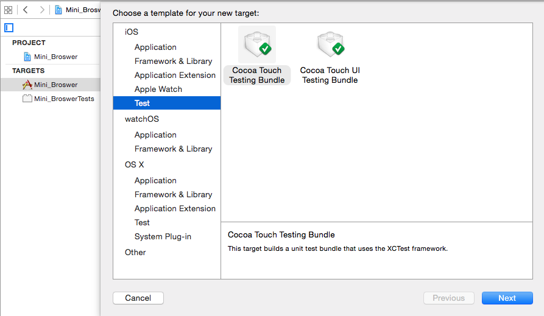
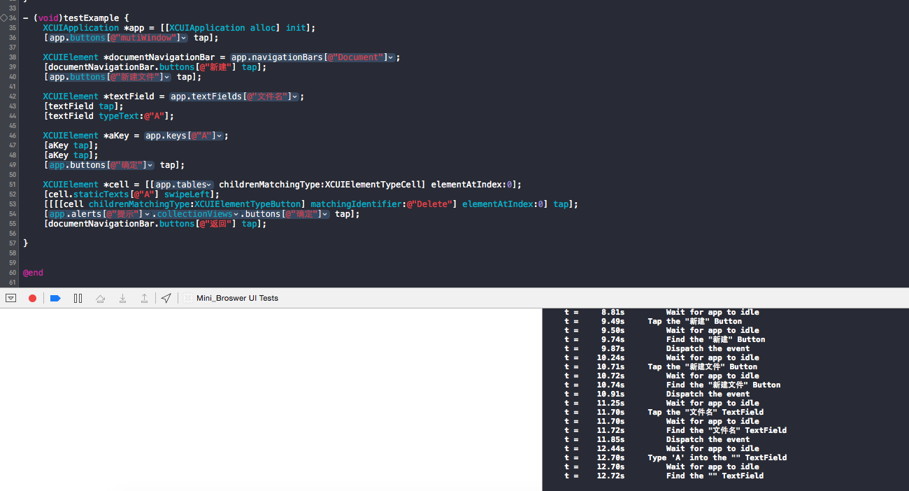

##XCode 7 UI Testing

在开发领域里，测试一直是保障产品质量关键。从 Xcode 4 以来，测试在 app 开发中的地位可谓是逐年上升。从 XCT 框架的引入，到测试 target 成为新建项目时的默认，再到去年加入的异步代码测试和性能测试。可以说现在 Xcode 自带的测试框架已经能满足绝大部分单元测试的需求了。

但是这并不够。开发一个 iOS app 从来都是更注重 UI 和用户体验的工作，而简单地单元测试可以很容易地保证 model 层的正确，却很难在 UI 方面有所作为。如何为一个 app 编写 UI 测试一直是 Cocoa 社区的难题之一。之前的话有像是 KIF，Automating，甚至是 FBSnapshotTestCase 这种脑洞大开的方案。今年 Apple 给出了一个更加诱人的选项，那就是 Xcode 自带的 XCUITest 的一系列工具。

和大部分已有的 UI 测试工具类似，XCUI 使用 Accessibility 标记来确定 view，但因为是 Apple 自家的东西，它可以自动记录你的操作流程，所以你只需要书写最后的验证部分就可以了，比其他的 UI 测试工具方便很多。
在Xcode 7 ，UI Testing 比之前InStruments 的UIAutomation 更加方便，好用。使用新的XCTest ，需要在project 新建一个UI Testing Bundle。

***
录制好脚本后，点击运行：

**参考链接**

[Testing：Xcode 7 UI testing, a first look](http://www.mokacoding.com/blog/xcode-7-ui-testing/).